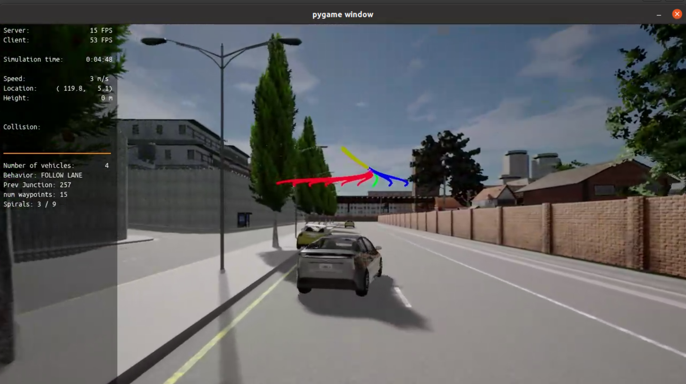

# Project: Motion Planning and Decision Making for Autonomous Vehicles

In this project, you will implement two of the main components of a traditional hierarchical planner: The Behavior Planner and the Motion Planner. Both will work in unison to be able to:

1. Avoid static objects (cars, bicycles and trucks) parked on the side of the road (but still invading the lane). The vehicle must avoid crashing with these vehicles by executing either a “nudge” or a “lane change” maneuver.

2. Handle any type of intersection (3-way, 4-way intersections and roundabouts) by STOPPING in all of them (by default)

3. Track the centerline on the traveling lane.

To accomplish this, you will implement:

* Behavioral planning logic using Finite State Machines - FSM
* Static objects collision checking.
* Path and trajectory generation using cubic spirals
* Best trajectory selection though a cost function evaluation. This cost function will mainly perform a collision check and a proximity check to bring cost higher as we get closer or collide with objects but maintaining a bias to stay closer to the lane center line.

## Starter Files

This repository contains the starter code to launch in the SDC Planning course workspace. 

Clone the repository

```bash
git clone https://github.com/udacity/nd013-c5-planning-starter.git
cd nd013-c5-planning-starter
```

To get started, switch to the project directory

```bash
cd project
```

You should see the project structure as follow:

```bash
.
├── README.md # Must read
├── cserver_dir
├── install-ubuntu.sh
├── manual_control.py
├── run_carla.sh
├── run_main.sh
├── simulatorAPI.py
└── starter_files
```


## Installation
 
### For Windows & Ubuntu 18.04 and Earlier
* Pre-requisites:
   * python3.7
   * carla (API)
   * pip 
   * numpy
   * pygame 
   * gtest
   * websocket
* Additional installations:
   * sudo apt install python3.7
   * python3.7 -m pip install -U pip carla numpy pygame websocket-client --user
   * sudo apt-get install -y libgoogle-glog-dev libgtest-dev

   
* The deb installation is the easiest way to get the latest release in Linux.
```
sudo apt-key adv --keyserver keyserver.ubuntu.com --recv-keys 1AF1527DE64CB8D9
sudo add-apt-repository "deb [arch=amd64] http://dist.carla.org/carla $(lsb_release -sc) main"
sudo apt-get update # Update the Debian package index
sudo apt-get install carla-simulator=0.9.10-2 
cd /opt/carla-simulator
# Linux
./CarlaUE4.sh
```

More details can be found at [CARLA Quick Start Installation](https://carla.readthedocs.io/en/latest/start_quickstart/)  
> NOTE: CARLA does NOT work on Ubuntu 20.04 or Mac yet!!
  
* Make sure ALL is working well:
   * Open a terminal an launch CARLA (if you don't have it open already):
   ```bash
   cd /opt/carla-simulator
   # Linux
   ./CarlaUE4.sh
   ```

### Install all dependencies

Run the following commands in another terminal window inside the project folder:
```bash
./install-ubuntu.sh
```

Then, compile the `rpclib` library. This library is a msgpack-rpc library written using modern C++. The goal of this library is to provide a simple, no-nonsense RPC solution.
```bash
cd starter_files
rm -rf rpclib
git clone https://github.com/rpclib/rpclib.git
cmake .
make
```

## Project Setup Instructions

Now it is time for you to start working on your project. Please review the [rubric](https://learn.udacity.com/rubric/2949) here for a full understanding of the project grading requirements.

In the `starter_files` folder you will find all important files you need to work on:

    - behavior_planner_FSM.cpp
    - planning_params.h
    - motion_planner.cpp
    - velocity_profile_generator.cpp
    - cost_functions.cpp


## Build the project and run the simulator

Run the following commands in the existing terminal window:
```bash
cd starter_files/
cmake .
make
cd nd013-c5-planning-starter/project
./run_main.sh
# This will silently fail 
# ctrl + C to stop 
```



If error bind is already in use, or address already being used
```bash
ps -aux | grep carla
kill id # use the displayed id in the terminal
```

